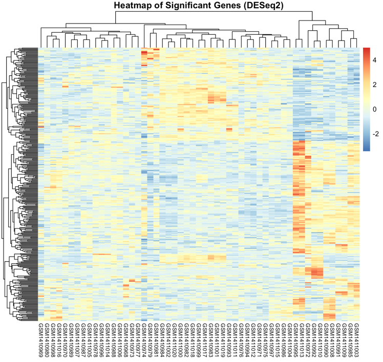

# Identifying Key Asthma Genes Across Datasets

Bioinformatics project by Gal Carmely and Ran Benayoun  
Multi-dataset analysis reveals key genes and therapeutic targets.

---

## Abstract

Asthma is a chronic respiratory disease characterized by airway inflammation, bronchial hyperresponsiveness, and tissue remodeling. Despite the availability of treatments, the molecular mechanisms underlying asthma and its subtypes remain incompletely understood. In this project, we aimed to identify genes and biological pathways associated with asthma by integrating transcriptomic data from multiple datasets.

We analyzed bulk RNA-Seq data from asthma patients and controls derived from both epithelial and smooth muscle cells using the DESeq2 package. To improve the robustness of our analysis, we focused on common differentially expressed genes (DEGs) shared across all datasets, especially those originating from airway epithelial cells. This strategy allowed us to identify pathways consistently enriched across datasets, reducing dataset-specific noise while acknowledging that some biologically important pathways might be detected only in specific datasets.

Differential expression and subsequent enrichment analyses using Gene Ontology (GO), Reactome, and KEGG databases revealed biologically relevant processes, including neuroactive ligand-receptor interactions, regulation of blood pressure, and extracellular matrix remodeling.

Additionally, ROC curve analysis was performed to assess the predictive potential of individual DEGs, although no genes showed strong discriminatory power between asthma and control samples. Finally, integration with the Comparative Toxicogenomics Database (CTD) confirmed that several of the identified DEGs have previously been associated with asthma or related respiratory diseases, supporting the consistency of our findings with existing knowledge.

In conclusion, our analysis highlights neuro-immune signaling, vascular regulation, and extracellular matrix remodeling as key processes in asthma. These findings contribute to a better understanding of the disease's molecular basis and may inform future research on asthma pathophysiology.

*Based on methods and analysis from: [Identification of key genes and pathways between mild-moderate and severe asthmatics via bioinformatics analysis](https://www.nature.com/articles/s41598-022-06675-w#Sec11)*

---

## Biological Questions to Answer

- **How do these genes contribute to asthma progression?**
- **Can specific genes be used as biomarkers for diagnosing asthma?**
- **What pathways are involved in asthma disease?**
- **Are there potential drug interactions that may influence these genes?**

---

## Datasets

- **GSE58434:** Fatal Asthma (n=6) vs. Control (n=12)  
  Human Airway Smooth Muscle, transcriptome changes in response to Vitamin D or Albuterol
- **GSE201955:** DNA methylation signatures in airway epithelial cells from adult children of asthma mothers reflect subtypes of severe asthma  
  42 non-asthma, 88 asthma
- **GSE152004:** Nasal epithelium cells (NECs), 257 asthmatic and 136 control subjects

Three independent datasets used.  
All datasets are Bulk RNA-Seq.

---

## Results

**DGE:** Primary gene analysis using DESeq2

- Number of significant DEGs in dataset GSE58434: **367**
- Number of significant DEGs in dataset GSE201955: **419**
- Number of significant DEGs in dataset GSE152004: **28**
- Number of common DEGs across Epithelial datasets: **17**
- Number of common DEGs across all datasets: **1**

**HBD - Hemoglobin subunit delta**  
- **HBD** was the only gene consistently differentially expressed across all datasets, indicating its potential role in asthma pathophysiology.

---

### Heatmap

- **Asthma vs Control separation:** The heatmap reveals a clear clustering between Asthma and Control samples, reflecting distinct gene expression profiles.
- **Similar expression patterns within groups:** Samples within the same condition, including Asthma subgroups (Vitamin D or Albuterol treatment), exhibit similar gene expression patterns, indicating group-specific regulation.
- **Differentially regulated gene clusters:** Several gene blocks are upregulated (red) in subsets of samples (e.g., Asthma) and downregulated (blue) in others (e.g., Control), suggesting condition- and treatment-associated gene expression changes.

---

### Pathway Enrichment Analysis

**KEGG Pathways:**  

**Gene Ontology (GO):**  

**Reactome Pathways:**  

---

### Diagnostic Potential

**ROC Curve:**  

- No genes had AUC > 0.7, therefore no diagnostic potential was found.

---

### Chemical Interaction Analysis

**Chemical Interactions for 17 Common DEGs:**  

- *Interpretation:*  
  The chemical interaction network for the 17 common DEGs is highly convoluted, with many overlapping and indirect relationships. Due to this complexity, it is difficult to draw clear or actionable conclusions about specific chemical influences from this network alone.

**Chemical Interactions for HBD:**  

- *Interpretation:*  
  The chemical interaction map for **HBD** (Hemoglobin subunit delta) is more focused. This allows for further exploration of potential chemical modulators or drug interactions specifically affecting HBD, which may be relevant for asthma research and therapeutic development.

---

## References

- Identification of key genes and pathways between mild-moderate and severe asthmatics via bioinformatics analysis: https://www.nature.com/articles/s41598-022-06675-w#Sec11